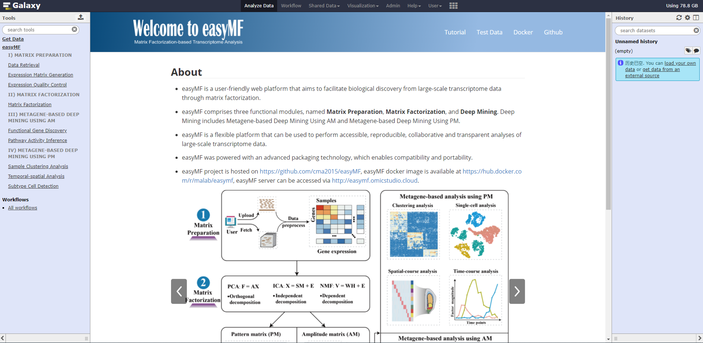

<div align="center"><h1><b>easyMF User Mannual</b></h1></div>

<div align="center">(version 1.0)</div>

easyMF is a user-friendly web platform that aims to facilitate biological discovery from large-scale transcriptome data through matrix factorization (MF). It offers several functional tools for gene expression matrix generation, and metagene-based exploratory analysis including sample clustering, signature gene identification, functional gene discovery, subtype cell detection, and pathway activity inference.

- easyMF project is hosted on https://github.com/cma2015/easyMF.
- easyMF docker image is available in https://hub.docker.com/r/malab/easymf.
- easyMF demo server can be accessed via [http://easyMF.omicstudio.cloud](http://easymf.omicstudio.cloud/).
- The following part shows installation of easyMF docker image and detailed documentation for each function in easyMF.


## easyMF installation

- **Step 1**: Docker installation

  **i) Docker installation and start (<a href="https://docs.docker.com/install" target="_blank">Official installation tutorial</a>)**

  For **Windows (Only available for Windows 10 Prefessional and Enterprise version):**

	* Download <a href="https://download.docker.com/win/stable/Docker%20for%20Windows%20Installer.exe" target="_blank">Docker</a> for windows;
	* Double click the EXE file to open it;
  * Follow the wizard instruction and complete installation;
  * Search docker, select ___Docker for Windows___ in the search results and click it.
  
  For **Mac OS X (Test on macOS Sierra version 10.12.6 and macOS High Sierra version 10.13.3):**
  
	- Download <a href="https://download.docker.com/mac/stable/Docker.dmg" target="_blank">Docker</a> for Mac OS;
  * Double click the DMG file to open it;
  * Drag the docker into Applications and complete installation;
  * Start docker from Launchpad by click it.

	For **Ubuntu (Test on Ubuntu 18.04 LTS):**

  * Go to <a href="https://download.docker.com/linux/ubuntu/dists/" target="_blank">Docker</a>, choose your Ubuntu version, browse to **pool/stable** and choose **amd64, armhf, ppc64el or s390x**. Download the **DEB** file for the Docker version you want to install;
  * Install Docker, supposing that the DEB file is download into following path:___"/home/docker-ce<version-XXX>~ubuntu_amd64.deb"___ </br>

    ```bash
      $ sudo dpkg -i /home/docker-ce<version-XXX>~ubuntu_amd64.deb      
      $ sudo apt-get install -f
    ```


  **ii) Verify if Docker is installed correctly**

  Once Docker installation is completed, we can run `hello-world` image to verify if Docker is installed correctly. Open terminal in Mac OS X and Linux operating system and open CMD for Windows operating system, then type the following command:

  ```bash
 $ docker run hello-world
  ```

   **<font color =red>Note</font>:** root permission is required for Linux operating system.

- Once Docker is installed successfully, you will see the following message:
  

- **Step 2**: easyMF installation from Docker Hub
```bash


# pull latest easyMF Docker image from docker hub
$ docker pull malab/easyMF
```
- **Step 3**: Launch easyMF local server
```bash
$ docker run -it -p 8080:8080 malab/easyMF bash
$ bash /home/galaxy/run.sh
```

Then, easyMF local server can be accessed via http://localhost:8080


