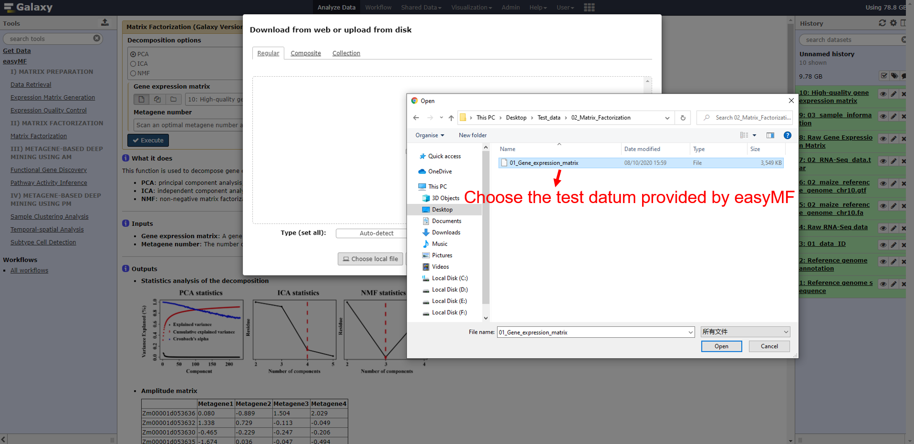
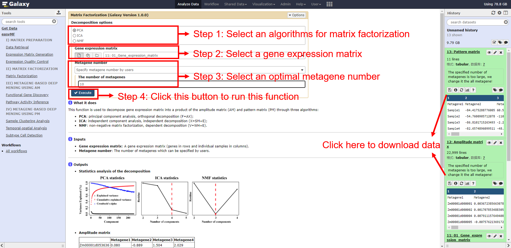

<h1><b>easyMF User Mannual</b></h1>

(version 1.0)

easyMF is a user-friendly web platform that aims to facilitate biological discovery from large-scale transcriptome data through matrix factorization (MF). It offers several functional tools for gene expression matrix generation, expression matrix factorization, and metagene-based exploratory analysis including sample clustering, signature gene identification, functional gene discovery, subtype cell detection, and pathway activity inference.

- easyMF project is hosted on https://github.com/cma2015/easyMF.
- easyMF docker image is available in https://hub.docker.com/r/malab/easymf.
- easyMF demo server can be accessed via [http://easyMF.omicstudio.cloud](http://deepea.omicstudio.cloud/).
- The following part shows installation of easyMF docker image and detailed documentation for each function in easyMF.

## 0. Matrix Factorization

Matrix Factorization can be used to decompose a gene expression matrix into an amplitude matrix (AM) and a pattern matrix (PM) using three different algorithms, i.e., principal component analysis (PCA), independent component analysis (ICA), and non-negative matrix factorization (NMF).

  <table class="fl-table">
  <thead>
    <tr>
      <th width="15%">Functions/Tools</th>
      <th width="15%">Description</th>
      <th width="15%">Inputs</th>
      <th width="15%">Outputs</th>
      <th width="15%">Time (test data)</th>
      <th width="15%">Program</th>
      <th width="25%">References</th>
    </tr>
  </thead>
  <tbody>
      <tr>
          <td rowspan="3">Matrix Factorization</td>
          <td rowspan="3">Decompose a gene expression matrix into a product of an amplitude matrix (AM) and pattern matrix (PM)</td>
          <td rowspan="3">Gene expression matrix</td>
          <td rowspan="3">Amplitude matrix; Pattern matrix</td>
          <td rowspan="3">~ 1 mins</td>
          <td>prcomp (PCA)</td>
          <td>This study</td>
      </tr>
      <tr>
          <td>ica (ICA)</td>
          <td><a href="https://cran.r-project.org/web/packages/ica/index.html">Helwig, 2015</td>
      </tr>
      <tr>
          <td>bignmf (NMF)</td>
          <td><a href="https://rdrr.io/github/panlanfeng/bignmf/man/bignmf.html">Pan <I>et al</I>., 2012</td>
      </tr>

#### Inputs

- **Decomposition options**: Different algorithms used for gene expression matrix decomposition including PCA, ICA, and NMF.

- **Gene expression matrix**: A gene expression matrix (genes in rows and individual samples in columns).

- **Metagene number**: The number of metagenes decomposed from the gene expression matrix. In current version, easyMF provides three options for users to set this number:

1) **Scan an optimal metagene number automatically by easyMF**: easyMF can automatically chosen an appropriate number using two methods: internal consistency of Cronbach's α value for **PCA** and inflection point of the rate of the mean residual decline for **ICA** and **NMF**;

2) **Set each sample as a metagene**: Setting the number of samples in the gene expression matrix as the number of metagenes;

3) **Specify metagene number by users**: A specified metagene number user provided.

#### Outputs

- **Statistics analysis of the decomposition**: If users need easyMF automatically chosen an optimal metagene number, easyMF would provide a comprehensive report statistics analysis of the decomposition.
- **Amplitude matrix**: Amplitude matrix decomposed from gene expression matrix (genes in rows and metagenes in columns).

|                | Metagene 1 | Metagene 2 | ...  | Metagene n |
| :------------- | :--------- | :--------- | :--- | ---------- |
| Zm00001d053636 | 0.080      | -0.889     | ...  | 2.029      |
| Zm00001d053632 | 1.338      | 0.729      | ...  | -0.049     |
| ...            | ...        | ...        | ...  | ...        |
| Zm00001d053635 | -1.674     | 0.036      | ...  | -0.494     |

- **Pattern matrix**: Pattern matrix decomposed from gene expression matrix  (samples in rows and metagenes in columns).

|          | Metagene 1 | Metagene 2 | ...  | Metagene n |
| :------- | :--------- | :--------- | :--- | ---------- |
| Sample 1 | -2.081     | 0.663      | ...  | -0.711     |
| Sample 2 | -2.114     | 0.711      | ...  | -0.757     |
| ...      | ...        | ...        | ...  | ...        |
| Sample 4 | -2.185     | 0.671      | ...  | -0.719     |

#### How to use this function

* Test datum for this function is `01_Gene_expression_matrix` in directory `Test_data/02_Matrix_Factorization`.

- The following screenshots show us how to decompose the gene expression matrix using easyMF.

	**Step 1**: upload test data in directory `Test_data/02_Matrix_Factorization` to history panel;
	
	
	
	**Step 2**: input the corresponding files and appropriate parameters, then run the function.
	
	

#### Running time

This step will cost ~ 1 mins for the test data.